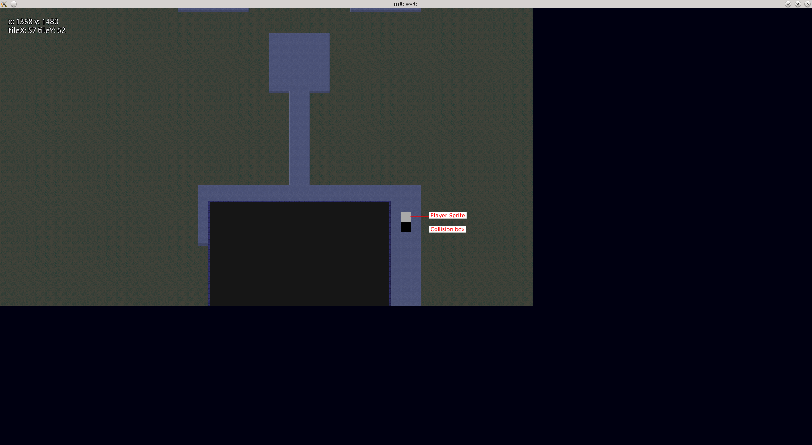
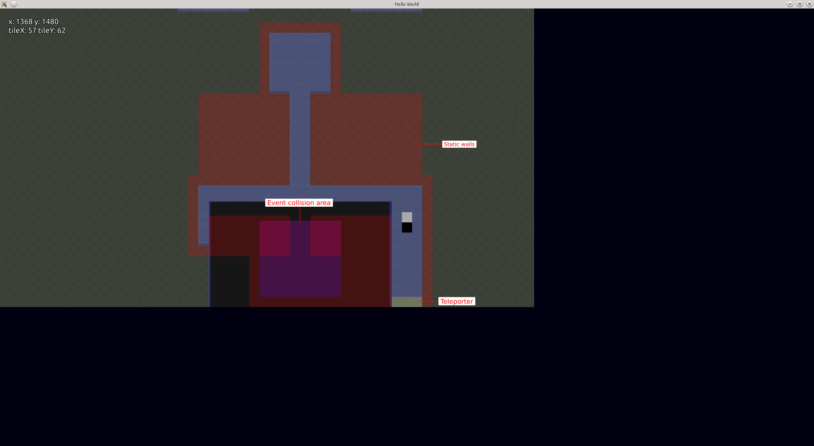
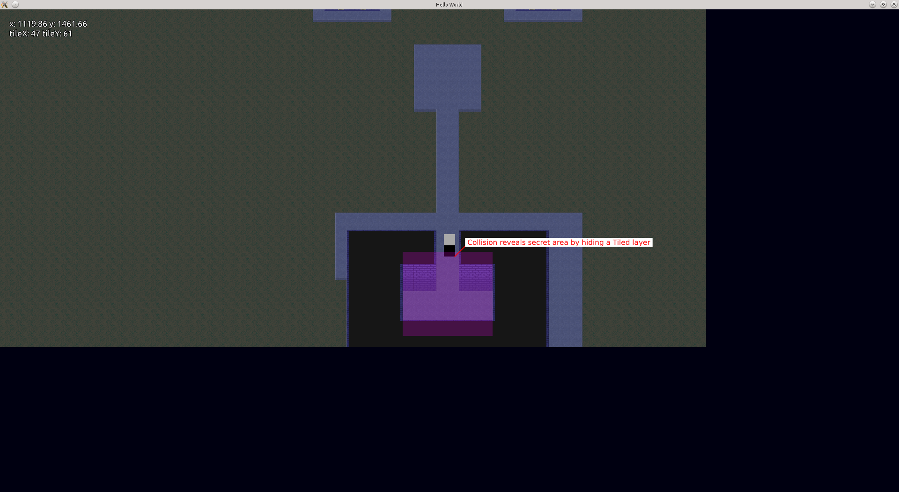

About Tiled QML plugin
-------------------------------------------------------------------------------

This is a plugin for using Tiled maps with QtQuick (Tiled Map Editor - http://www.mapeditor.org/)

Tiled is a general purpose tile map editor for all tile-based games, such as
RPGs, platformers or Breakout clones.

The purpose is to use the current master branch of tiled instead of the dusted wip/qtquick branch (and at some point in time mainline this code back to tiled)

This code is based on code from Tiled see:
https://github.com/mitchcurtis/tiled/tree/58c7fa2c66d74fc63e7426ae0e439761480b8a40

And for the example code:
https://github.com/mitchcurtis/quick-tmx-viewer

## Example screenshots

